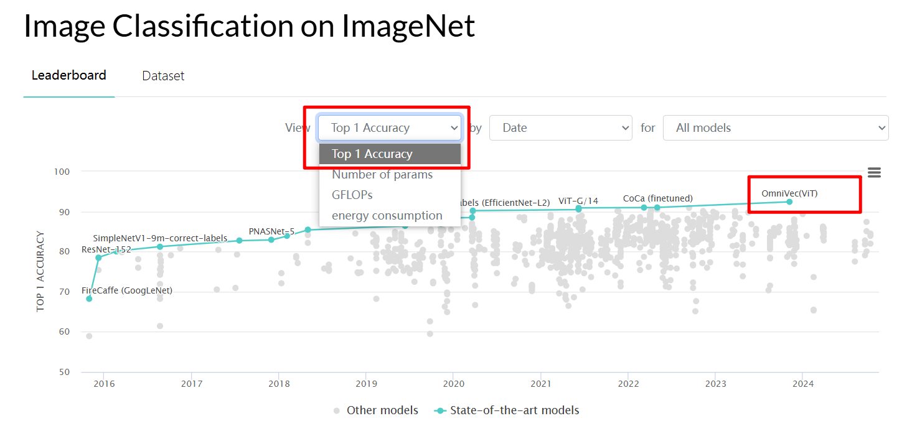
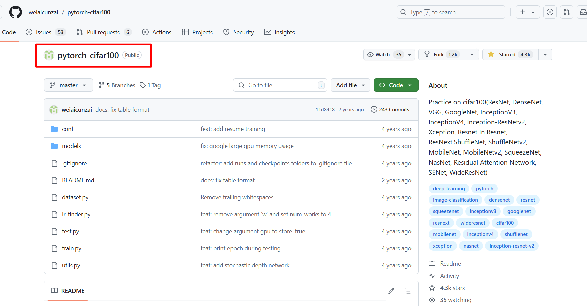
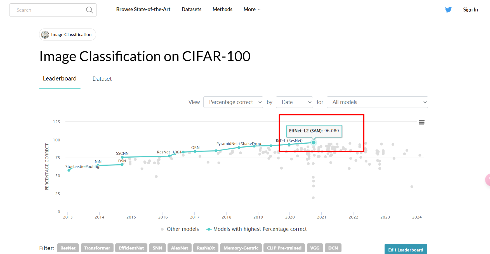

# 5. 如何阅读人工智能研究论文

> 导读: 在刚迈入科研时，人人都说读论文很重要，但是很少有人能完整地教你应该如何读论文。论文不仅揭示了行业的最新进展和趋势，而且为我们提供了改进技术和解决复杂问题的思路。然而，由于学术论文常常包含密集的技术细节和专业术语，新手可能会觉得门槛较高。
>
> 本课程旨在真实展示在学习人工智能新领域时所需的步骤，我希望在这门课程结束时，你能够在阅读人工智能研究论文时掌握可以使用的工作流程。
## 本教程目标
1. 进行文献检索以识别与感兴趣的主题相关的论文
2. 阅读深度/机器学习研究论文并总结其贡献
## 本教程内容
### 0. 方法

我将把阅读人工智能研究论文的过程分为两部分：**广泛阅读和深度阅读**。没有固定的先后顺序，这里有一个建议的顺序：

1. 针对完全没有接触过深度学习或机器学习的小白，建议先挑一个简单的任务进行深度阅读(代码加论文，可参考我的回答：[研究生真的应该研一大量读文献吗？](https://www.zhihu.com/question/353178050/answer/3197251465)
2. 针对有一定基础的同学来说，开始调研新的领域时，建议从广泛阅读着手，然后再精挑一两篇进行深度阅读。

广泛阅读意味着浏览文献，并阅读各个论文的小部分内容。广泛阅读的目标是构建和改进我们对研究主题的整体认知。一旦在广泛阅读中确定了你想要深入理解的关键技术点，就可以开始进行深入阅读：我一般是指完全理解代码细节以及论文每一个公式。广泛阅读和深入阅读都是必需的，且可能互相迭代，尤其是在你刚开始的时候。

我们还是以图像分类(image classification)为例，作为我们想要探讨的假设主题，非常具体地向你介绍如何进行广泛阅读和深度阅读。

### 1. 深度阅读

让我们从简单的搜索引擎(谷歌/必应/百度)或者大模型搜索“图像分类(image classification)”开始。建议一开始可以从中文看起，毕竟比较好理解，基本概念都掌握之后，要多用英文搜索，现在有翻译，也比较方便。

我们可以先了解有关图像分类的定义。在脑海里建立了一个初步的印象，就是对图像进行分类。但是在代码层面如何实现你肯定还是一头雾水，接下来就是需要具体跑代码（由于之前跑过图像分类代码，这里是假设你现在在调研一个新的方向）。接下来介绍两个寻找代码非常有用的链接：

#### 1.1[Papers With Code](https://paperswithcode.com/)

Papers with Code 是一个社区项目，这个网站创建包含机器学习论文、代码、数据集、方法和评估表的免费开放资源。我自己以及身边人在科研过程中也会经常用到这个网站，推荐给大家。

我们需要开始做笔记，所以让我们打开一个文档（可以用自己经常用的，我推荐用在线的一些文档管理比如飞书，或者记录在本地，也可以用typora软件）。

让我们看到下面带有代码的论文的 Benchmarks (基准测试)部分。下面列举了在不同数据集下，最先进的模型，以及论文和代码。

点击ImageNet，会跳转到下面这个链接，说明在2024年出现了一种最先进的方法（你可能听说过 SOTA），方法称之为ViT。排行榜非常有用：它向我们展示了包括和类似变体在内的指标，其次我们需要了解它们是什么。

再回到主页往下看，还有经常用的框架，这个框架就是一个比较完整的系统，一般来说代码量比较多，一下子比较难看懂底层实现原理，一开始上手可能会有些难。但是，有共同的实现平台，因此在这个上面也比较容易和其他方法做对比。

这是实现最多的论文，一般来说都是比较经典的，有代表性的论文，比如大名鼎鼎的ResNet，并且也有代码和对应的代码：Deep Residual Learning for Image Recognition。

我们就可以点ResNet的code链接，可以看到也有好多种实现的方法。

**注意：**

> 1.一般来说，目前学术界主流的框架都是用pytorch，并且pytorch使用起来也比较方便，用的人多也意味着很多问题都能在公开的论坛里找到解决方法
>
> 2.建议一开始可以从一个简单的代码学起，就是不用一上来就去学习框架。这有助于弄懂每一个模块，等弄懂了简单的代码，再去研究如何使用框架效率会更高。（对于初学者而言，找一个简单的代码最有效的方法就是寻求专业人士的帮助，比如问问师兄，老师有无推荐的上手代码）

这里为了更好的演示网路，我选择了这个[代码库](https://github.com/weiaicunzai/pytorch-cifar100)，该数据集在cifar100 数据集上进行训练各种图像分类网络，能够很快地帮助我们理解ResNet是什么？如何更好地理解ResNet。

#### 1.2 [Github](https://github.com/)

GitHub 在深度学习科研中扮演着至关重要的角色，提供了一个开源平台，使得研究人员可以共享他们的代码、数据集、模型和实验结果。这种开放性和共享精神促进了科研成果的交流和复用，加速了科学进步的步伐。

具体使用方法如下，在搜索框，搜索自己研究方向的关键词，比如"image classification/图片分类"，建议中英文都可以结合着搜一下。

**star数量越多，说明这个代码仓库越受欢迎。**awsome系列一般很受欢迎，因为这类代码库的特点就是把很多资料和代码整理到一起，类似于paper with code，会比paper with code资料更加丰富。

#### 1.3 跑通代码

上面已经介绍了如何寻找代码，但是很多同学还是会一脸懵，面对这么多的代码，我怎么知道该实现哪一个代码？或者面对一个代码仓库，我看不懂他的操作流程。这很正常，跟着别人操作。下面介绍一个可以实操的方法，在bilibili上输入关键词，"图像分类/image classification"。

**注意：**

> 当你还没有很清楚某个任务的技术细节时，因此先不用花太多时间在学习概念，阅读论文。
>
> 一定要明确一件事，深度阅读阶段最重要的是什么？深入代码，完整地走通整个任务的流程细节。

因此可以跟着UP的视频一步一步去实现代码。在实现的过程中难免会遇到一些bug，该怎么解决呢？可以参考参考第二章节如何解决问题。

跑通完代码，就需要花几天时间，配合大模型去搞懂每一行代码的意思，在这个过程中也要边做好记录：

这个过程大概花上一周时间就可以了。一周之后，通过这个流程，你就建立起了对这个领域的基本的认知。

要注意的是：如果是有代码基础，视频学习取决于个人需要，可以在了解了基本概念之后，直接通过那两个链接去寻找合适简单的代码实现，就可以了解任务细节了。

#### 1.4 精读论文

当我们弄懂一篇论文对应的代码之后，我们就可以很轻松的阅读对应的文章，以及理解文章中提到一些抽象的名词，比如“跳跃连接”，“多层特征融合”等等。所以**真正精度一篇文章，最好的方法是结合代码来读**，因此精度第一篇文章花费的时间和精力会很多，这个是很正常的事，一开始切记囫囵吞枣图快，一开始要把基础打牢，就要把很多基础的知识点，弄懂弄透。

但是一次性也很难弄懂所有的知识点，因此我建议采取迭代的方式来精读论文：

- 首先要明确在你的第一次阅读中，你不会理解超过研究论文的10%。这篇论文可能需要我们阅读另一篇更基础的论文（这可能需要阅读第三篇论文，以此类推；可能是一层又一层！）。
- 然后，在你的第二次阅读中，你可能会理解20%的内容。要理解论文的100%可能需要一个重大的飞跃，可能是因为它写得不好，细节不足，或者技术/数学上过于先进。因此，我们的目标是尽可能地理解论文——理解70-80%的论文是一个好目标。

我们将逐步阅读ResNet论文，我会带你了解我的第一次阅读经历。在阅读论文时能够进行标记或评论是个好方法，你可以使用浏览器自带的编辑器或者是WPS软件来高亮PDF。[ResNet论文](https://arxiv.org/pdf/1512.03385v1)

**首先阅读引言部分**，引言是开始论文的好方式，因为它们通常是概括性说明了文章的背景和方法。（在后续的教程中，我将分享如何写好论文的引言）

这种使用不同颜色高亮来区分文本的方法非常有效，它帮助我们清晰地识别出论文中的问题、解决方案和主要贡献。**通过黄色高亮显示问题或挑战，粉红色高亮显示解决这些挑战的方案，蓝色则用于突出论文的主要贡献**，你已经建立了一种直观的方式来组织和理解信息。

你所描述的交替使用黄色和粉红色高亮的模式表明，论文是通过引入一个普遍问题开始的，然后讨论解决这个问题的方法，接着是这个解决方案中的问题，然后是对该问题的又一个解决方案。深入到四个层级，论文明确指出了它解决的具体问题。

随后可以看到，论文的贡献是针对更一般问题的更一般解决方案中的特定问题的特定解决方案，这是典型的结构。

我们可以总结我们对这一问题-解决方案链的理解：

论文中写得比较好的引言应该让你能够提取出这样的问题-解决方案链。

**对于相关工作(related work)**我们可以不用精读，因为我们缺少 10-20 篇论文的背景信息，我们需要阅读这些论文来填补空白。这是论文中我们不会深入理解的 20-30%。

对于方法部分，我们可以做的是记录我们还不太理解的概念列表：如果有指向论文参考文献的链接，我们会将其复制过来。看起来可能是这样的：

因此，你将创建一个需要学习的概念列表，以及每个概念的相关论文（如果论文指定了任何概念）。当阅读完一遍之后，就可以专门去学习这些概念，然后再重新阅读一遍论文，会有一种豁然开朗的感觉。

让我们继续阅读**方法部分和实验部分**：

最后，我们来读一下**论文的结论**。

你可能会注意到，尽管结论与摘要和引言相似，但我们对这些单词的理解已经比开始阅读本文时更深一些了。正如我之前提到的，第一次阅读论文时，我们预计实际上只能理解其中的 10%，特别是如果我们不了解正在构建的论文的背景的话。；使用同样的方法，我们可以开始浏览“To Understand”列表。

### 2. 广度阅读

**广度阅读，一般是在调研/寻找灵感的时候比较需要，或者是在写论文整理素材的时候。**如何有效的阅读，也很重要，但是很多人把握不好这个度，比如很多人非常重视，恨不得天天花大量时间去阅读论文，做大量的笔记。也有另一个极端，就是丝毫不重视论文，大致瞄一眼，只能是留了个大概的印象，后面在写论文/想要引用的时候，却找不到应该引用哪个，以致对整个领域都没有一个全面的认知。

对于初学者而言，我还是十分建议在完成上面深度阅读的步骤之后，再开展广度阅读，之后就可以交替进行。

下面具体介绍如何适度的去阅读一篇论文，还是以paper with code上的论文为例，我们已经复现了一个图像分类的代码，一般来说是比较经典的网络，我们要跟踪最新的方法，就得靠阅读论文。

以下面EffNet-L2方法为例，我们点击cifar 100数据集

点击方法名称，就会跳到下面这个页面：

点击PDF，就能跳转到论文原文，我们来读一下摘要。

我们对里面有些名词不熟悉很正常，所以不要试图能理解所有句子，在我们的笔记中记下关键信息。

在这里，我们只是整理了摘要中的关键信息。很多知识点，关键词不理解也没有关系，如果实在好奇，可以问chatgpt或者其他大模型。最重要的是了解最新的方法，只要大概在脑海里留下一个印象，大概用了什么方法，性能怎么样就好。然后我们就可以对多篇文章，进行类似的总结。

可以继续在笔记中添加条目，也可以采用另外一种方式，也是我当时读论文采用的方式，可以用其他方式来管理阅读，比如excel，一篇论文就是一条记录，分别记录主题，时间，期刊/会议，标题，相关工作，结果等

除了用表格记录，还可以用一些其他的软件记录，这里就不过多赘述了，因为工具本质上都是术，最重要的是要去行动。

 **谷歌学术**

接下来我们可以利用谷歌学术。让我们首先输入搜索词：**classification**.

谷歌学术按相关性排序，并提供了一些有用的细节包括论文被引用的次数。我们运气不错——搜索结果的顶部有一篇综述论文，综述论文通常会回顾和描述一个问题领域的现状，并经常包括挑战和机遇。

综述可能不总是最新的、全面的或完全准确的，但特别是如果我们对某个领域不熟悉，它可以帮助我们快速了解。

考虑到我们看到一些相对较新的论文（2023年）达到了状态最优（SOTA），我们不想看一篇2019年的综述，可以通过明确搜索综述并使用左侧的时间线侧边栏过滤掉2023年以前的结果，看看能否找到一个更近的综述。

这一篇有pdf版本，我们来看看结果。

你可能会发现，对于综述论文来说，摘要通常不会提供和普通研究文章一样的具体细节。然而，综述论文通常更易于理解（至少在某些部分），因为它们包括了更多关于主题的背景信息。我们来打开这篇文章看看。

阅读一篇综述文章时，我们应该如何进行？在这个阶段，我们广泛阅读，可以选择性地阅读内容。对于这篇论文，我读了：

- 综述的图1，这通常很好展示了综述的关键点。
- 第二页的“贡献”部分，这篇综述主要总结了哪些内容
- 最后一页的“结论与未来方向”。

这些相对较短的部分应该足够我们现阶段使用，花点时间自己阅读这些部分，看看你是否能总结出8-10个要点的笔记。

目前为止，我们已经有至少 1-2 页的笔记了！你的笔记和我的可能包含许多你第一次遇到的术语。这些术语可能超出了我们当前的理解范围，但这没关系，因为我们是在广泛阅读。

### 3.结论

我希望一步一步演示在刚开始接触一个新领域时，如何读论文，以使得让你有把握深入研究新的问题。

广读和精读的过程都是迭代的：我们经常需要重新搜索和重读，边读边做笔记的行为可以极大地帮助建立和交叉检查你对这个领域的认知。